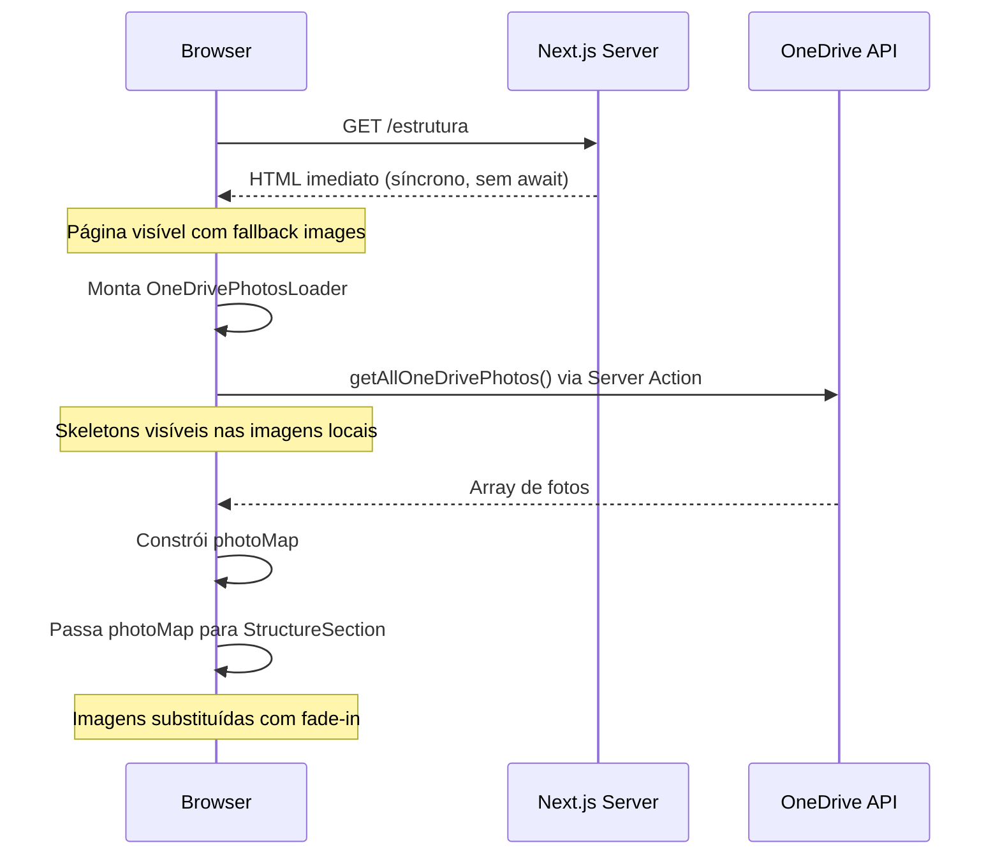
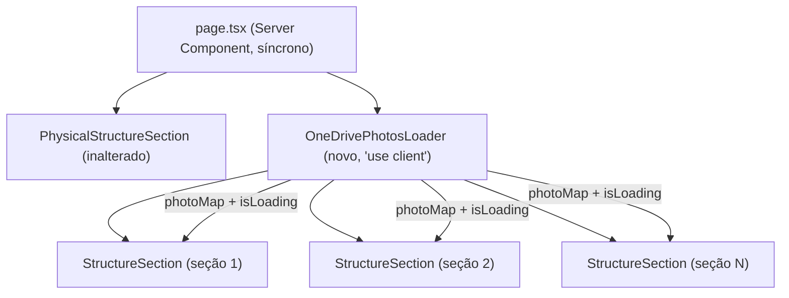

# Design Document: estrutura-instant-load

## Overview

A página `/estrutura` atualmente bloqueia a navegação porque o Server Component executa `await getAllOneDrivePhotos()` antes de enviar qualquer HTML ao browser. A solução é tornar a página síncrona e mover a busca de dados para o cliente, usando um novo componente `OneDrivePhotosLoader` que carrega as fotos após a montagem e distribui o `photoMap` para os filhos via props.

O resultado é uma página que renderiza instantaneamente com imagens fallback locais e, em segundo plano, substitui as imagens pelas fotos reais do OneDrive com skeletons e transição suave.

## Architecture





## Components and Interfaces

### `page.tsx` (refatorado)

Remove o `async` e o `await getAllOneDrivePhotos()`. O array `sections` permanece estático. O componente passa `sections` para `OneDrivePhotosLoader` e renderiza `PhysicalStructureSection` diretamente.

```tsx
// Antes
export default async function Estrutura() {
  const allPhotos = await getAllOneDrivePhotos()
  // ...
}

// Depois
export default function Estrutura() {
  // sem await, sem chamada ao OneDrive
}
```

### `OneDrivePhotosLoader` (novo — `src/components/OneDrivePhotosLoader.tsx`)

Componente cliente que:
1. Chama `getAllOneDrivePhotos()` no `useEffect` após montagem
2. Constrói o `photoMap: Record<string, string>` (`{ nameWithoutExt: url }`)
3. Renderiza os filhos (`StructureSection`) passando `photoMap` e `photosLoading`

```tsx
'use client'

interface OneDrivePhotosLoaderProps {
  sections: SectionData[]
}

export function OneDrivePhotosLoader({ sections }: OneDrivePhotosLoaderProps) {
  const [photoMap, setPhotoMap] = useState<Record<string, string>>({})
  const [photosLoading, setPhotosLoading] = useState(true)

  useEffect(() => {
    getAllOneDrivePhotos()
      .then(photos => {
        const map = photos.reduce((acc, p) => ({ ...acc, [p.nameWithoutExt]: p.src }), {})
        setPhotoMap(map)
      })
      .catch(() => { /* silencioso — mantém fallback */ })
      .finally(() => setPhotosLoading(false))
  }, [])

  return (
    <>
      {sections.map((section, index) => (
        <StructureSection
          key={section.id}
          {...section}
          reversed={index % 2 !== 0}
          photoMap={photoMap}
          photosLoading={photosLoading}
        />
      ))}
    </>
  )
}
```

### `StructureSection` (atualizado — `src/components/StructureSection.tsx`)

Recebe duas novas props opcionais:

```tsx
interface StructureSectionProps {
  id: string
  title: string
  subtitle: string
  items: Item[]
  reversed?: boolean
  photoMap?: Record<string, string>      // novo
  photosLoading?: boolean                // novo
}
```

Lógica de resolução da imagem ativa:

```tsx
function resolveImageSrc(
  originalSrc: string,
  photoMap: Record<string, string>,
  photosLoading: boolean
): { src: string | null; showSkeleton: boolean } {
  const isLocalAsset = originalSrc.startsWith('/assets/')

  if (photosLoading && isLocalAsset) {
    return { src: null, showSkeleton: true }
  }

  const nameWithoutExt = originalSrc.split('/').pop()?.split('.')[0]?.toLowerCase()
  const oneDriveSrc = nameWithoutExt ? photoMap[nameWithoutExt] : undefined

  return {
    src: oneDriveSrc ?? originalSrc,
    showSkeleton: false
  }
}
```

No render da imagem ativa:
- Se `showSkeleton=true`: renderiza `<div className="animate-pulse bg-slate-200 absolute inset-0" />`
- Se `showSkeleton=false`: renderiza `<Image>` com `className` incluindo `transition-opacity duration-300`

## Data Models

### `PhotoMap`

```ts
type PhotoMap = Record<string, string>
// Chave: nameWithoutExt (ex: "e011")
// Valor: URL pública do OneDrive (ex: "https://...")
```

### `SectionData` (existente, sem alteração)

```ts
interface Item {
  title: string
  description: string
  image: string        // caminho local (/assets/eXXX.jpg) ou URL externa
  capacidade?: string
  fabricante?: string
  observacoes?: string
}

interface SectionData {
  id: string
  title: string
  subtitle: string
  items: Item[]
}
```

### Estado do `OneDrivePhotosLoader`

```ts
{
  photoMap: Record<string, string>  // vazio {} enquanto carrega
  photosLoading: boolean            // true até a promise resolver/rejeitar
}
```

## Correctness Properties

*A property is a characteristic or behavior that should hold true across all valid executions of a system — essentially, a formal statement about what the system should do. Properties serve as the bridge between human-readable specifications and machine-verifiable correctness guarantees.*

### Property 1: PhotoMap preserva todos os dados das fotos

*For any* array de fotos retornado por `getAllOneDrivePhotos()`, o `photoMap` construído deve conter uma entrada para cada foto, onde a chave é `nameWithoutExt` e o valor é `src`.

**Validates: Requirements 2.2**

### Property 2: Skeleton exibido para imagens locais durante loading

*For any* item de seção cuja imagem começa com `/assets/`, quando `photosLoading=true`, o componente `StructureSection` deve exibir um skeleton no lugar da imagem.

**Validates: Requirements 3.1**

### Property 3: Imagem do OneDrive exibida quando há correspondência

*For any* `photoMap` e qualquer item cuja chave `nameWithoutExt` existe no `photoMap`, quando `photosLoading=false`, a imagem exibida deve ser a URL do OneDrive correspondente.

**Validates: Requirements 3.2**

### Property 4: Fallback exibido quando não há correspondência

*For any* `photoMap` e qualquer item cuja chave `nameWithoutExt` não existe no `photoMap`, quando `photosLoading=false`, a imagem exibida deve ser a imagem original do item (fallback local), sem skeleton.

**Validates: Requirements 3.3, 5.3**

### Property 5: Conteúdo textual independente do photoMap

*For any* seção e qualquer estado de `photoMap` (incluindo vazio `{}`), todos os textos estáticos (título, descrição, capacidade, fabricante, observações) devem estar presentes no DOM renderizado.

**Validates: Requirements 5.1**

## Error Handling

| Cenário | Comportamento |
|---|---|
| `getAllOneDrivePhotos()` lança exceção | `catch` silencioso; `photosLoading` vai para `false`; `photoMap` permanece `{}`; todas as imagens exibem fallback local |
| `getAllOneDrivePhotos()` retorna array vazio | `photoMap` fica `{}`; todas as imagens exibem fallback local |
| Foto do OneDrive com URL inválida | `next/image` trata o erro de carregamento; fallback não é automático neste nível (comportamento existente mantido) |
| `nameWithoutExt` não encontrado no `photoMap` | Fallback local exibido (Property 4) |

Não há mensagem de erro exibida ao usuário em nenhum cenário de falha do OneDrive — a página permanece completamente funcional com as imagens locais.

## Testing Strategy

### Abordagem

A feature envolve lógica de transformação de dados (construção do `photoMap`) e lógica de renderização condicional (skeleton vs. imagem vs. fallback). Ambas são adequadas para property-based testing com mocks.

A biblioteca recomendada é **fast-check** (TypeScript/JavaScript), com mínimo de 100 iterações por propriedade.

### Testes de Propriedade (fast-check)

Cada teste de propriedade referencia a propriedade correspondente do design.

**Property 1 — PhotoMap preserva todos os dados**
```
Feature: estrutura-instant-load, Property 1: PhotoMap preserva todos os dados das fotos
```
Gerar arrays aleatórios de objetos `{ nameWithoutExt: string, src: string }`, aplicar a função de construção do `photoMap`, verificar que `photoMap[p.nameWithoutExt] === p.src` para todo `p`.

**Property 2 — Skeleton para imagens locais durante loading**
```
Feature: estrutura-instant-load, Property 2: Skeleton exibido para imagens locais durante loading
```
Gerar itens com `image` começando em `/assets/`, renderizar `StructureSection` com `photosLoading=true`, verificar presença do elemento skeleton.

**Property 3 — Imagem OneDrive quando há correspondência**
```
Feature: estrutura-instant-load, Property 3: Imagem do OneDrive exibida quando há correspondência
```
Gerar `photoMap` e itens com correspondência garantida, renderizar com `photosLoading=false`, verificar que `src` da imagem é a URL do OneDrive.

**Property 4 — Fallback quando não há correspondência**
```
Feature: estrutura-instant-load, Property 4: Fallback exibido quando não há correspondência
```
Gerar `photoMap` e itens sem correspondência, renderizar com `photosLoading=false`, verificar que `src` é o original e não há skeleton.

**Property 5 — Conteúdo textual independente do photoMap**
```
Feature: estrutura-instant-load, Property 5: Conteúdo textual independente do photoMap
```
Gerar seções com textos aleatórios e qualquer `photoMap`, verificar que todos os textos estão presentes no DOM.

### Testes de Exemplo (unit tests)

- `OneDrivePhotosLoader` chama `getAllOneDrivePhotos()` exatamente uma vez após montagem
- `OneDrivePhotosLoader` não exibe mensagem de erro quando `getAllOneDrivePhotos()` lança exceção
- `OneDrivePhotosLoader` não re-fetcha em re-renders
- Página renderiza as 7 seções com seus IDs corretos
- Skeleton contém a classe `animate-pulse`
