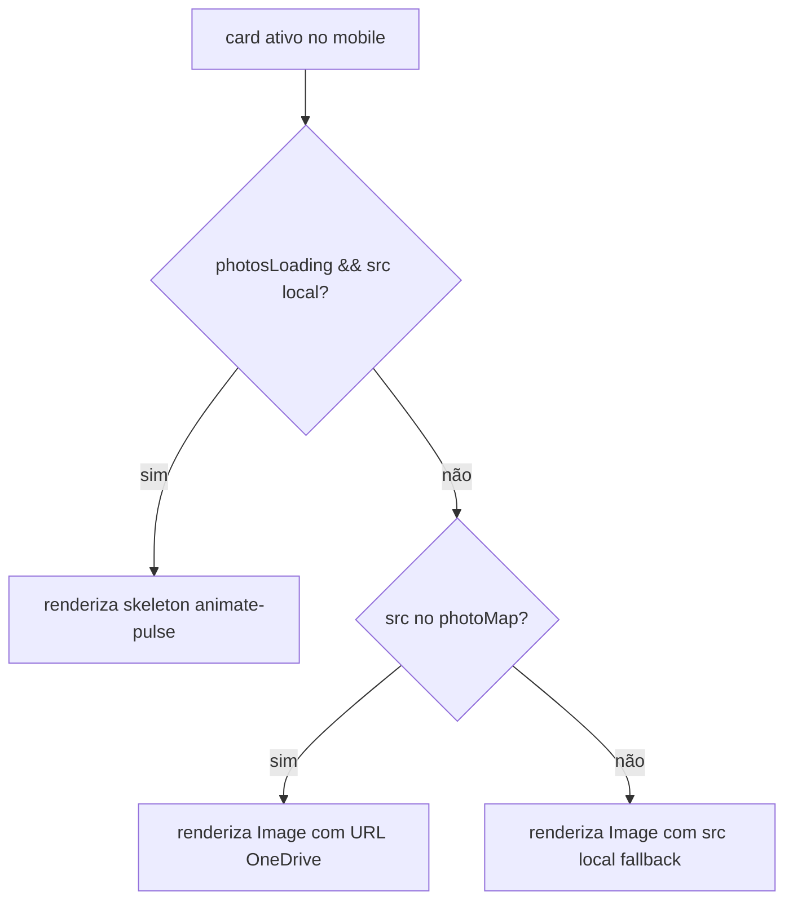

# Design Document

## Feature: mobile-inline-machine-photo

## Overview

O componente `StructureSection` exibe uma lista de cards de máquinas à esquerda e uma imagem grande à direita no desktop. No mobile, o layout empilha verticalmente, mas a imagem fica separada dos detalhes, forçando rolagem desnecessária.

Esta feature adiciona um bloco de foto inline dentro do card expandido, visível apenas no mobile (< 1024px / breakpoint `lg` do Tailwind). No desktop, o comportamento atual é preservado integralmente. Nenhum novo arquivo é criado — apenas `src/components/StructureSection.tsx` é modificado.

## Architecture

A mudança é puramente de apresentação dentro de um único componente React. Não há alteração de estado, props, lógica de negócio ou camada de dados.

```
StructureSection.tsx
├── Content Side (lg:w-1/2)
│   └── cards (map over items)
│       └── AnimatePresence (detalhes expansíveis)  ← já existe
│           ├── detalhes textuais (capacidade, fabricante, observações)  ← já existe
│           └── [NOVO] bloco de foto inline (block lg:hidden)
│               └── AnimatePresence mode="wait"
│                   └── motion.div (fade-in + scale)
│                       ├── skeleton (se showSkeleton)
│                       └── Image fill object-cover (se !showSkeleton)
└── Image Side (lg:w-1/2)  ← adicionar "hidden lg:block"
```

**Fluxo de decisão da foto inline:**



## Components and Interfaces

### Mudanças em `StructureSection.tsx`

**1. Bloco de foto inline (novo)**

Adicionado dentro do `motion.div` expansível existente (após os detalhes textuais), condicionado a `activeIndex === index`:

```tsx
{/* Foto inline — apenas mobile */}
<div className="mt-4 block lg:hidden">
  <div className="relative aspect-[4/3] w-full rounded-xl overflow-hidden">
    <AnimatePresence mode="wait">
      {(() => {
        const { src, showSkeleton } = resolveImageSrc(
          item.image,
          photoMap ?? {},
          photosLoading ?? false
        )
        if (showSkeleton) {
          return (
            <motion.div
              key="skeleton"
              initial={{ opacity: 0 }}
              animate={{ opacity: 1 }}
              exit={{ opacity: 0 }}
              className="absolute inset-0 animate-pulse bg-slate-200"
            />
          )
        }
        return (
          <motion.div
            key={src ?? 'local'}
            initial={{ opacity: 0, scale: 1.02 }}
            animate={{ opacity: 1, scale: 1 }}
            exit={{ opacity: 0 }}
            transition={{ duration: 0.3 }}
            className="absolute inset-0"
          >
            {src && (
              <Image
                src={src}
                alt={item.title}
                fill
                className="object-cover"
                unoptimized={src.startsWith('http')}
              />
            )}
          </motion.div>
        )
      })()}
    </AnimatePresence>
  </div>
</div>
```

**2. Image Side — ocultar no mobile**

Adicionar `hidden lg:block` ao container externo do Image Side:

```tsx
{/* Image Side */}
<div className="lg:w-1/2 w-full hidden lg:block">
```

### Props e dependências

Nenhuma prop nova é necessária. O componente já recebe `photoMap`, `photosLoading` e já importa `resolveImageSrc`, `Image`, `motion`, `AnimatePresence`.

## Data Models

Sem alterações. O tipo `Item` e `StructureSectionProps` permanecem inalterados.

## Correctness Properties

*A property is a characteristic or behavior that should hold true across all valid executions of a system — essentially, a formal statement about what the system should do. Properties serve as the bridge between human-readable specifications and machine-verifiable correctness guarantees.*

### Property 1: Visibilidade da foto inline por activeIndex

*For any* lista de items e qualquer `activeIndex` válido, o bloco de foto inline deve estar presente no DOM apenas para o card cujo `index === activeIndex`, e ausente para todos os demais cards.

**Validates: Requirements 1.1, 1.3**

### Property 2: Skeleton quando photosLoading e src local

*For any* item cuja `image` começa com `/assets/` e com `photosLoading = true`, o bloco de foto inline deve renderizar o elemento skeleton (com `animate-pulse`) em vez de um ``.

**Validates: Requirements 2.1**

### Property 3: Foto remota quando chave presente no photoMap

*For any* item e `photoMap` que contenha a chave correspondente ao nome do arquivo da imagem, o componente `Image` renderizado na foto inline deve ter `src` igual ao valor do `photoMap` para aquela chave.

**Validates: Requirements 2.2**

## Error Handling

| Situação | Comportamento |
|---|---|
| `photoMap` undefined | `photoMap ?? {}` — fallback para objeto vazio, usa src local |
| `photosLoading` undefined | `photosLoading ?? false` — assume carregamento concluído |
| `src` null (skeleton ativo) | Bloco de foto inline renderiza skeleton; `Image` não é montado |
| Chave ausente no `photoMap` | `resolveImageSrc` retorna `originalSrc` como fallback (comportamento existente) |

Nenhum tratamento de erro adicional é necessário — a lógica de `resolveImageSrc` já cobre todos os casos de borda.

## Testing Strategy

### Abordagem

A feature envolve lógica de renderização condicional (qual bloco aparece, qual src é usado) e estrutura CSS (classes de visibilidade). A função `resolveImageSrc` já existe e é pura, tornando-a adequada para property-based testing. O restante das verificações são example-based (estrutura JSX, classes CSS).

**Biblioteca PBT:** `fast-check` (já disponível no ecossistema do projeto via vitest).

### Testes de Propriedade (PBT)

Cada teste deve rodar mínimo 100 iterações.

**Property 1 — Visibilidade por activeIndex**
- Tag: `Feature: mobile-inline-machine-photo, Property 1: foto inline presente apenas no card ativo`
- Gerar: lista aleatória de items (1–10), activeIndex aleatório válido
- Verificar: apenas o card com `index === activeIndex` contém o bloco de foto inline

**Property 2 — Skeleton quando loading**
- Tag: `Feature: mobile-inline-machine-photo, Property 2: skeleton quando photosLoading e src local`
- Gerar: item com `image` começando em `/assets/` + string aleatória, `photosLoading = true`
- Verificar: elemento com `animate-pulse` presente, `` ausente

**Property 3 — Foto remota do photoMap**
- Tag: `Feature: mobile-inline-machine-photo, Property 3: src da foto inline igual ao valor do photoMap`
- Gerar: item com `image` local, `photoMap` com a chave correspondente mapeada para URL aleatória
- Verificar: `src` do `Image` renderizado é igual ao valor do `photoMap`

### Testes de Exemplo (Unit)

- Image Side tem classe `hidden lg:block`
- Foto inline tem classes `block lg:hidden`, `aspect-[4/3]`, `rounded-xl`, `overflow-hidden`, `w-full`
- `Image` renderizado tem props `fill` e `className="object-cover"`
- Fallback: chave ausente no `photoMap` → `src` é o `originalSrc`
- `AnimatePresence` com `mode="wait"` envolve o bloco de foto inline
